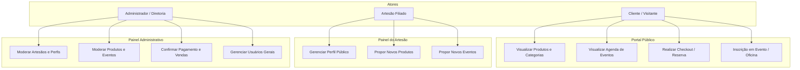
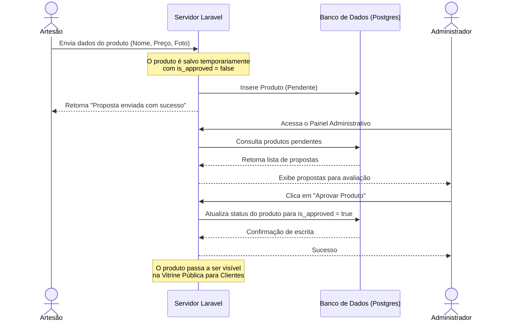
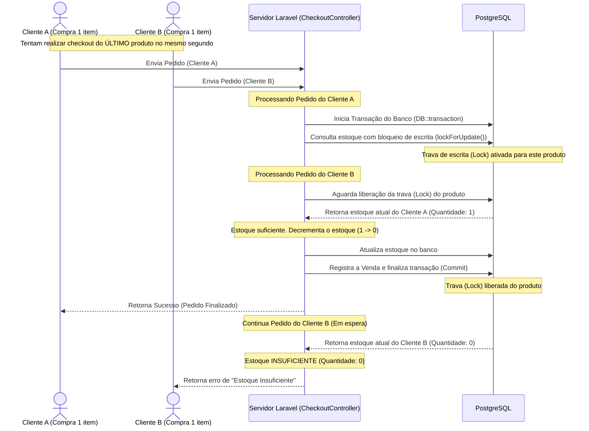

# Associação dos Artesãos de Caxias

> Plataforma web institucional, administrativa e de gerenciamento de pedidos de artesanato da Associação de Artesãos de Caxias (MA). Desenvolvida sob os mais altos padrões de Engenharia de Software utilizando **Laravel 12** e **Bootstrap 5**, atuando como vitrine cultural de alta fidelidade e painel administrativo centralizado.
> 
> **Faculdade UniFacema**  
> **Curso:** Tecnologia em Análise e Desenvolvimento de Sistemas (ADS)  
> **Disciplina:** Projeto Integrador Extensionista: Back-end  

**Link do Sistema em Produção:** [associacao-de-artesaos-de-caxias-production.up.railway.app](https://associacao-de-artesaos-de-caxias-production.up.railway.app/)

---

## Sumário

1. [Contexto, Problema e Justificativa](#1-contexto-problema-e-justificativa)
2. [Arquitetura Geral do Sistema (MVC & Fluxo SPA-like)](#2-arquitetura-geral-do-sistema-mvc--fluxo-spa-like)
3. [Mapeamento de Casos de Uso (Atores)](#3-mapeamento-de-casos-de-uso-atores)
4. [Requisitos Detalhados (Engenharia de Requisitos)](#4-requisitos-detalhados-engenharia-de-requisitos)
5. [Modelagem Relacional (Dicionário de Banco de Dados)](#5-modelagem-relacional-dicion%C3%A1rio-de-banco-de-dados)
6. [Fluxos de Negócio e Segurança de Dados (Mermaid)](#6-fluxos-de-neg%C3%B3cio-e-seguran%C3%A7a-de-dados-mermaid)
7. [Arquitetura de Segurança da Informação](#7-arquitetura-de-seguran%C3%A7a-da-informa%C3%A7%C3%A3o)
8. [Tecnologias Utilizadas](#8-tecnologias-utilizadas)
9. [Deploy Contínuo (Railway e Neon)](#9-deploy-cont%C3%ADnuo-railway-e-neon)
10. [Licença](#10-licen%C3%A7a)

---

## 1. Contexto, Problema e Justificativa

Este sistema foi projetado e desenvolvido como o protótipo funcional e especificação técnica para a disciplina de **Projeto Integrador Extensionista: Back-end** do curso de **Tecnologia em Análise e Desenvolvimento de Sistemas** da **UniFacema** (Caxias - MA).

### Dimensão Extensionista (Impacto Comunitário e Social)
Como um **Projeto Extensionista**, este sistema visa conectar o conhecimento tecnológico gerado na academia com os anseios de desenvolvimento e inclusão da comunidade local:
- **Inclusão Digital**: Fornece uma plataforma simplificada e moderna que capacita os artesãos de Caxias a gerenciar digitalmente seus perfis, expor seu trabalho e coletar reservas de produtos, transpondo barreiras de acesso tecnológico tradicional.
- **Desenvolvimento Econômico Local**: Estimula a geração de renda descentralizada e a sustentabilidade financeira dos artesãos filiados ao divulgar a vitrine de produtos e simplificar o contato direto com compradores locais e turistas via WhatsApp.
- **Preservação do Patrimônio Cultural**: Resgata e registra digitalmente a memória da associação, a biografia dos artistas e a identidade cultural regional do município de Caxias (MA).

### O Problema
A Associação de Artesãos de Caxias (MA) enfrenta barreiras na expansão de sua representatividade cultural e comercialização física. A dependência de intermediários, a falta de um catálogo digital atualizado em tempo real e a complexidade administrativa de coordenar propostas individuais de dezenas de produtores de forma centralizada são desafios constantes.

### A Solução
Uma plataforma web unificada e de fácil escalabilidade que descentraliza a inclusão de produtos e eventos. O próprio artesão realiza a submissão do seu trabalho a partir de um painel de acesso simplificado, enquanto a diretoria da associação retém o controle absoluto de moderação (garantia de qualidade e procedência) e auditoria de vendas em um painel administrativo robusto.

---

## 2. Arquitetura Geral do Sistema (MVC & Fluxo SPA-like)

O projeto baseia-se no padrão arquitetural **MVC (Model-View-Controller)** oferecido nativamente pelo framework Laravel, segregando as responsabilidades de negócio das interfaces de apresentação.

```
                    ┌─────────────────────────┐
                    │       Navegador         │
                    └────────────┬────────────┘
                                 │ Requisição HTTP
                                 ▼
                    ┌─────────────────────────┐
                    │    Roteador (Web.php)   │
                    └────────────┬────────────┘
                                 │
                                 ▼
                    ┌─────────────────────────┐
                    │       Controller        │
                    └────────────┬────────────┘
                     ▲          │           ▲
                     │          │           │ Retorna
        Acessa/Modifica │          │ Renderiza │ View
                     │          │           │ (Blade)
                     ▼          ▼           │
              ┌──────────┐ ┌──────────┐ ┌───┴──────┐
              │  Model   │ │ Banco de │ │   View   │
              │ (Eloquent│ │  Dados   │ │ (HTML,   │
              │  ORMs)   │ │ (Postgres│ │ CSS, JS) │
              └──────────┘ └──────────┘ └──────────┘
```

### Transição SPA-like Dinâmica
Para otimizar o tempo de renderização e oferecer uma experiência fluida aos usuários móveis (responsividade premium), o front-end conta com um mecanismo JavaScript que intercepta requisições de links internos.
- **Como funciona:** O script carrega apenas o corpo do conteúdo principal dinamicamente via AJAX (`fetch`) promovendo transições suaves de opacidade (`fade-in` / `fade-out`) sem necessidade de recarregar cabeçalhos, rodapés ou recriar sessões de conexão com o banco de dados. Isso reduz drasticamente o tráfego de dados móveis no celular dos visitantes.

---

## 3. Mapeamento de Casos de Uso (Atores)

O sistema possui três papéis (`roles`) definidos de usuários: **Clientes/Visitantes**, **Artesãos** e **Administradores**.



---

## 4. Requisitos Detalhados (Engenharia de Requisitos)

### Requisitos Funcionais (RF)

| ID | Requisito Funcional | Descrição | Especificação Técnica / Implementação |
|----|---------------------|-----------|----------------------------------------|
| **RF01** | Cadastro de Contas | Permitir que visitantes criem contas tradicionais no sistema preenchendo nome, e-mail único e senha criptografada. | `AuthController@store` usando `Hash::make()` para segurança de credenciais. |
| **RF02** | Login Seguro | Autenticar usuários no sistema com base no perfil (`role`) a que pertencem, redirecionando ao painel correto. | Middleware `auth` e redirecionamento dinâmico em `AuthController@login`. |
| **RF03** | Solicitação de Perfil | Permitir que usuários cadastrados solicitem promoção ao perfil de "Artesão" enviando dados profissionais adicionais. | Rota `user.tornar-se-artesao` salvando relação 1:1 com `ArtisanProfile`. |
| **RF04** | Proposta de Produtos | Artesãos aprovados devem cadastrar propostas de novos produtos especificando nome, descrição, foto, preço e categoria. | `ArtisanController@salvarProduto` com status `is_approved = false` por padrão. |
| **RF05** | Proposta de Eventos | Artesãos devem poder solicitar inserção de exposições ou eventos na agenda pública. | `ArtisanController@salvarEvento` salvando registro com moderação pendente. |
| **RF06** | Moderação Administrativa | Administradores podem revisar propostas de produtos/eventos e aprovar/recusar ou desativar contas de usuários. | `AdminDashboardController` protegida pelo middleware `admin`. |
| **RF07** | Vitrine e Busca | Listar dinamicamente na página inicial todos os produtos devidamente aprovados e ativos por categorias. | `ProdutoController@index` filtrando por `is_approved = true`. |
| **RF08** | Inscrições em Eventos | Clientes autenticados podem se inscrever ou cancelar presença em eventos com limite de vagas. | `InscricaoController` controlando limite de vagas do model `Eventos`. |
| **RF09** | Reserva de Produtos | Permitir o fechamento de pedidos (carrinho de compras) gerando venda automática e controlando estoques. | `CheckoutController@store` processando transação imediata sem gateway externo. |

### Requisitos Não-Funcionais (RNF)

| ID | Requisito Não-Funcional | Descrição | Especificação Técnica / Implementação |
|----|-------------------------|-----------|----------------------------------------|
| **RNF01** | Integridade dos Dados | Garantir a persistência e consistência de dados em um banco de alta fidelidade industrial. | Motor de banco relacional **PostgreSQL 16** com chaves primárias e estrangeiras indexadas. |
| **RNF02** | Responsividade | Todo o design do sistema deve se adaptar automaticamente a telas de smartphones, tablets e desktops. | Layout mobile-first estruturado em **Bootstrap 5.3** e CSS nativo. |
| **RNF03** | Desempenho SPA | A navegação nas páginas não deve forçar recarregamento inteiro da página (full reload) para reduzir latência. | Interceptação de links com Fetch API JavaScript e transições dinâmicas de CSS. |
| **RNF04** | Transação e Concorrência | Evitar race-conditions (vendas simultâneas acima do estoque físico real do banco). | Uso do método `lockForUpdate()` no registro do estoque antes do decremento da venda. |
| **RNF05** | Segurança de Sessão | Proteger o sistema de ataques de interceptação de sessão ou injeções de formulários. | Middleware padrão do Laravel utilizando tokens **CSRF** e senhas hash **BCrypt**. |

---

## 5. Modelagem Relacional (Dicionário de Banco de Dados)

O diagrama relacional do banco de dados (implementado no **PostgreSQL**) baseia-se nas seguintes entidades essenciais:

### Tabela: `users`
Armazena dados gerais de autenticação e perfis de controle de acesso do sistema.
- `id` (BIGINT, PK): Identificador único do usuário.
- `name` (VARCHAR, 255): Nome completo do usuário.
- `email` (VARCHAR, 255, Unique): Endereço de e-mail institucional/pessoal.
- `password` (VARCHAR, 255): Hash BCrypt criptografado da senha.
- `role` (VARCHAR, 20): Nível de privilégio do sistema (`admin`, `artisan`, `user`).
- `is_active` (BOOLEAN): Status da conta. Contas inativas são impedidas de efetuar login.

### Tabela: `artisan_profiles`
Mantém as informações de relevância e currículo público dos artesãos aprovados.
- `id` (BIGINT, PK): Identificador do perfil.
- `user_id` (BIGINT, FK): Relacionamento 1:1 com a tabela `users`.
- `phone` (VARCHAR, 20): Telefone direto de contato.
- `specialty` (VARCHAR, 100): Especialidade artística (ex: argila, madeira, bordado).
- `bio` (TEXT): Breve descrição biográfica do artesão.
- `profile_photo` (VARCHAR, 255): Caminho da foto de perfil armazenada em disco/nuvem.
- `cpf` (VARCHAR, 14): Registro físico de identificação nacional do artesão.
- `whatsapp` / `instagram` / `facebook` (VARCHAR, 100): Canais de contato digitais.
- `approved_at` (TIMESTAMP): Data e hora que a administração aprovou o perfil.

### Tabela: `produto`
Armazena os detalhes dos produtos cadastrados e vinculados aos artesãos.
- `id_produto` (BIGINT, PK): Identificador do produto.
- `nome` (VARCHAR, 255): Nome comercial do produto.
- `descricao` (TEXT): Detalhamento técnico da peça.
- `preco` (DECIMAL, 10,2): Valor comercial do item em Real (BRL).
- `imagem` (VARCHAR, 255): Caminho físico da imagem do produto.
- `is_approved` (BOOLEAN): Define se a proposta do produto foi aprovada e está visível na vitrine pública.
- `id_categoria` (BIGINT, FK): Relacionamento com `categorias_produtos` para taxonomia.
- `id_artesao` (BIGINT, FK): Relacionamento 1:N com `users` definindo o criador do produto.

### Tabela: `_estoques`
Controle físico e concorrente de peças de artesanato.
- `id` (BIGINT, PK): Identificador do estoque.
- `id_produto` (BIGINT, FK, Unique): Chave estrangeira que assegura que cada produto tem uma única entrada de estoque.
- `quantidade` (INT): Estoque atual disponível de peças para compra.

### Tabela: `_vendas`
Armazena o cabeçalho dos pedidos registrados no sistema.
- `id_venda` (BIGINT, PK): Identificador do pedido.
- `id_cliente` (BIGINT, FK): Cliente que efetuou a compra (vinculado a `_cliente`).
- `data_venda` (TIMESTAMP): Data e horário exato do fechamento do pedido.
- `valor_total` (DECIMAL, 10,2): Total do pedido.
- `mp_status` (VARCHAR, 50): Status administrativo do pedido (`pending` para pendente, `approved` para confirmado).

### Tabela: `itens_venda`
Pivot que associa produtos, quantidades e preços a um pedido.
- `id` (BIGINT, PK): Identificador do item.
- `id_venda` (BIGINT, FK): Chave estrangeira vinculando o item ao pedido principal.
- `id_produto` (BIGINT, FK): Chave estrangeira vinculando o produto comprado.
- `quantidade` (INT): Total de itens daquele produto no pedido.
- `preco_unitario` (DECIMAL, 10,2): Preço do produto no instante da venda (proteção contra alterações de preço futuras).

### Tabela: `_eventos`
Gerenciamento de agenda da associação.
- `id` (BIGINT, PK): Identificador do evento.
- `nome` (VARCHAR, 255): Nome da oficina ou festival.
- `descricao` (TEXT): Detalhamento do evento.
- `data` (TIMESTAMP): Data do evento.
- `local` (VARCHAR, 255): Espaço onde ocorrerá a atividade.
- `vagas` (INT): Limite máximo de participantes permitidos.
- `is_approved` (BOOLEAN): Status de liberação pelo administrador.
- `id_artesao` (BIGINT, FK): Chave estrangeira ligada ao artesão proponente.

---

## 6. Fluxos de Negócio e Segurança de Dados (Mermaid)

### A. Fluxo de Submissão e Moderação de Conteúdo
Garante que nenhum produto ou evento vá ao ar sem auditoria explícita da diretoria da associação.



### B. Transação Segura com Travamento Concorrente (lockForUpdate)
Garante que em cenários de alta concorrência (ex: dois clientes tentando comprar a última unidade do mesmo item de argila simultaneamente), o sistema execute de forma consistente, impedindo estoque negativo ou pedidos duplicados.



---

## 7. Arquitetura de Segurança da Informação

O portal foi desenvolvido sob rígidos princípios de segurança para evitar os ataques mais comuns mapeados pela OWASP:

- **Criptografia das Senhas (Hashing):** O sistema utiliza o algoritmo **BCrypt** (padrão de hashing criptográfico seguro contra ataques de força bruta) por meio de `Hash::make()` nativo do Laravel. Nenhuma senha é gravada em texto plano no banco de dados.
- **Proteção Contra CSRF (Cross-Site Request Forgery):** Todas as requisições de modificação de estado (`POST`, `PUT`, `DELETE`) exigem a presença de um token CSRF dinamicamente gerado. Requisições que não apresentarem esse token associado à sessão atual são abortadas imediatamente com erro HTTP 419.
- **Autenticação Baseada em Middleware:** As rotas internas são rigorosamente separadas por middlewares dedicados:
  - `auth`: Garante que apenas usuários com uma sessão ativa possam prosseguir.
  - `admin`: Permite acesso unicamente a usuários com o valor `role` igual a `'admin'`.
  - `artisan`: Garante acesso exclusivo a usuários do perfil `'artisan'` cujo perfil esteja aprovado pela administração.
- **Tratamento de Contas Inativas:** Se um usuário for desativado administrativamente (`is_active = false`), a sua sessão é imediatamente desautorizada em qualquer próxima ação.

---

## 8. Tecnologias Utilizadas

### Back-end
- **PHP 8.2+**: Linguagem de programação com tipagem forte e suporte a OOP avançada.
- **Laravel 12.x**: Framework de desenvolvimento ágil e seguro, provendo Eloquent ORM (Mapeador de Banco de Dados) e Query Builder com tratamento inteligente contra SQL Injection.

### Front-end
- **Bootstrap 5.3**: Biblioteca CSS responsiva com grid móvel adaptativo.
- **Vanilla Javascript**: Script customizado para navegação SPA-like, manipulação suave de transição de telas e controle de carrinho.
- **Outfit Font**: Família tipográfica premium importada diretamente do Google Fonts para polimento visual.

### Banco de Dados & Armazenamento
- **PostgreSQL 16 (Neon Serverless)**: Banco de dados relacional de alta confiabilidade hospedado na nuvem serverless do Neon. Garante integridade referencial por meio de restrições rígidas (Foreign Keys), suporte nativo a isolamento de transações e escalabilidade automatizada de computação e armazenamento.

---

## 9. Deploy Contínuo (Railway e Neon)

A plataforma conta com infraestrutura de **Integração Contínua e Deploy Contínuo (CI/CD)** conectando a branch principal aos serviços de nuvem **Railway** e **Neon**.

- **Hospedagem de Containers (Railway):** O Railway detecta automaticamente a estrutura do Laravel 12, compila os arquivos do frontend via NPM, gera o container Docker e executa o servidor web com certificado SSL automático.
- **Banco de Dados Serverless (Neon):** PostgreSQL hospedado no Neon, operando de forma desacoplada da aplicação. Oferece autoscaling automático de processamento e armazenamento, backups diários automatizados e alta disponibilidade.

Acesse o sistema online:  
[https://associacao-de-artesaos-de-caxias-production.up.railway.app/](https://associacao-de-artesaos-de-caxias-production.up.railway.app/)

---

## 10. Licença

Este projeto é desenvolvido para fins acadêmicos e disponibilizado sob os termos da licença **MIT**. Consulte o arquivo `LICENSE` para mais detalhes.
